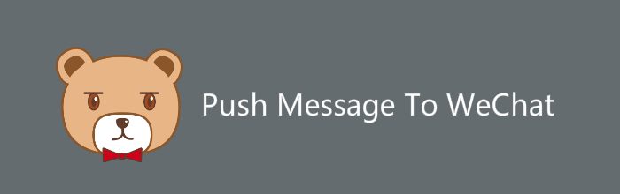
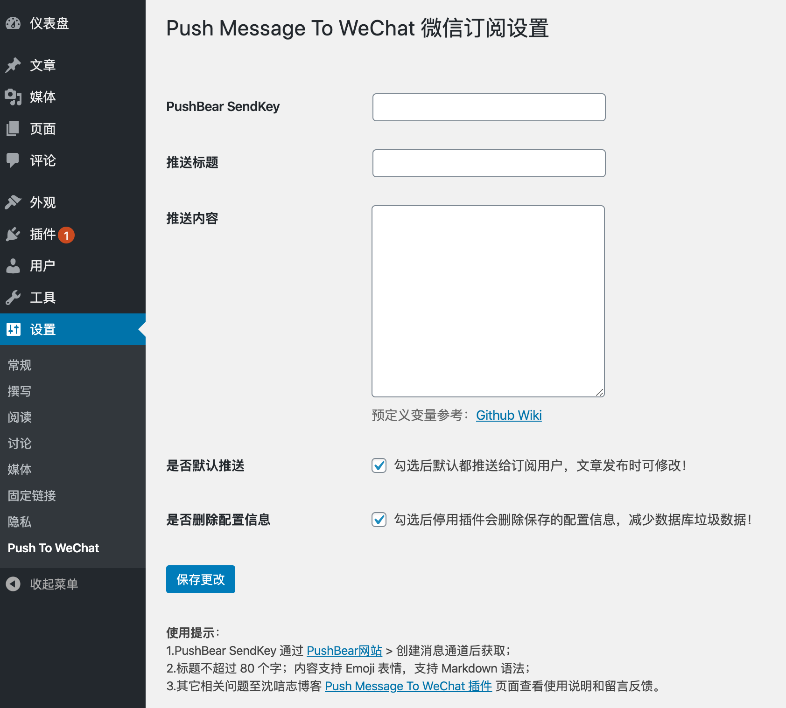

<h2 align="center">PushMessageToWeChat</h2>

基于 PushBear 服务提供 WordPress 内容更新微信订阅推送的插件

## 何为PushBear

`PushBear`是@Easy提供的一个基于微信模板的一对多消息送达服务，高效+超高到达

> 从2019年6月开始，只提供「已经微信认证后的服务号」进行授权后，用其自有接口权限代发。

1. 首先你需要准备一个认证后的微信服务号。
2. 然后在管理后台申请「模板消息」权限，分类选择「IT科技 → IT软件与服务」。
3. 申请通过以后，无需注册，直接[扫码登入PushBear](http://pushbear.ftqq.com/admin/#/signin)，在 PushBear 创建一个新的通道，然后点通道名称进入，点选「绑定通道」、「点我授权」。
4. 在绑定完成并授权之后，点生成通道二维码。（记住这个二维码扫码后应该提示关注你的服务号而不是方糖）
5. 关注后就可以通过 [API](http://pushbear.ftqq.com/admin/#/api) 向关注了该二维码的用户推送消息了，发送消息的也应该是你的服务号，而不是方糖的。

推送消息存储`72`小时、`5`分钟内不可发布重复消息、普通用户每天`1000`条上限、请勿用于发送广告和有害信息

## 如何使用

### 安装

`WordPress`后台搜索`Push Message To WeChat`

### 设置

- 方法一：在`WordPress`后台已安装的插件页面中有设置按钮，点击进入设置页面
- 方法二：在`WordPress`后台左侧导航栏`设置`下`Push To WeChat`，点击进入设置页面

### 填写配置

进入插件设置页面后，填入`PushBear`创建消息通道后的`SendKey`，自行选择勾选其他参数

## 如何订阅

在绑定完成并授权之后，点生成通道二维码，将此二维码给需要订阅的用户关注即可。

## 插件特色

* [x] 可填写配置信息，选择是否默认推送
* [x] 可自定义推送标题
* [x] 可自定义推送内容
* [x] 更新文章亦可选择是否推送
* [x] 可多次推送
* [x] 增加`PushBear`错误码，失败给予提示

## 更新日志

点击查看

### 2.0.0

* 发布至官方插件库 [Push Message To WeChat](https://wordpress.org/plugins/push-message-to-wechat/)

### 1.2.2

* 按需加载对应预定义变量
* 增加文章特色图片`{img}`预定义变量

### 1.2.1

* 增加推送成功失败提示

> 关于错误码问题，PushBear取消了接口返回值，减少接口调用次数

### 1.2.0

* 增加多次推送，并兼容前两版本
* 增加文章摘要`{excerpt}`预定义变量

### 1.1.0

* 修改默认推送和删除逻辑
* 增加自定义推送标题和内容

### 1.0.0

* 🎉第一个版本现世，为了给博客增加活跃度，顺手写了插件

